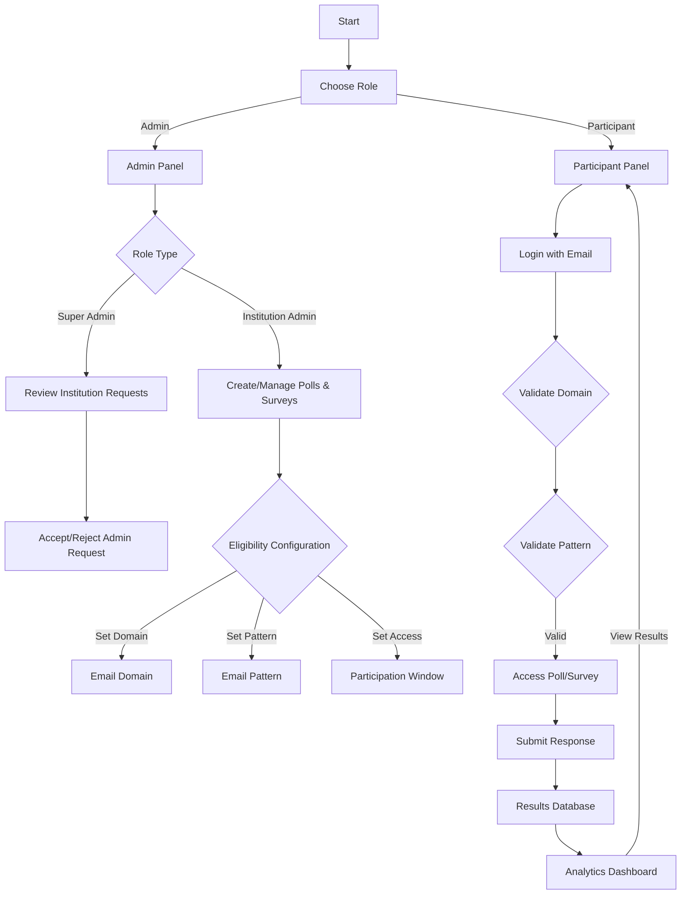

                                                          
<div align="center">

  
  # 📊 Institutional Voting & Survey Platform

  <p align="center">
    <b>Secure domain-restricted polls & surveys for educational institutions</b>
  </p>
  
  <p align="center">
    
    
    
    
  </p>
  
</div>

## 🌟 Overview

**QuickVote** provides institutions like universities and colleges with a dedicated platform for conducting secure online polls and comprehensive surveys limited to their official domain members. The system leverages domain-based email validation with OTP verification and JWT authentication to ensure participation security.

## 🚀 Key Features

<table>
  <tr>
    <td width="50%">
      <h3>🔐 Institution-Specific Access</h3>
      <ul>
        <li>Domain-locked user registration (e.g., only <code>@ddu.ac.in</code> emails)</li>
        <li>Pattern-based filtering (e.g., <code>22ituos***@ddu.ac.in</code>)</li>
        <li>JWT-based authentication with role segregation</li>
      </ul>
    </td>
    <td width="50%">
      <h3>📊 Comprehensive Admin Tools</h3>
      <ul>
        <li>Intuitive poll/survey creation interface</li>
        <li>Rich analytics dashboard with visual representations</li>
        <li>Export functionality (CSV/PDF)</li>
      </ul>
    </td>
  </tr>
  <tr>
<td width="50%">
  <h3>🗳️ Functional Voting & Survey Modules</h3>
  <ul>
    <li>Multiple questions and options directly fetched from Excel sheet</li>
    <li>MCQ-based polls</li>
    <li>OTP-based secure participation</li>
    <li>Time-restricted poll/survey access</li>
  </ul>
</td>
    <td width="50%">
      <h3>👥 Role-Based Access & Visualization</h3>
      <ul>
        <li>Three roles: Super Admin, Admin, User</li>
        <li>Super Admin handles approval/rejection of institution admins</li>
        <li>Admins manage polls/surveys, Users participate</li>
        <li>Results displayed using bar charts, pie charts, and abstract analysis</li>
      </ul>
    </td>
  </tr>
</table>


## 🛠️ Technology Stack

### Frontend
- **React.js** - UI library
- **Vite** - Next-generation frontend tooling
- **Axios** - HTTP client for API requests
- **JWT Decode** - For token handling
- **Chart.js** - Data visualization

### Backend
- **Java with Spring Boot** - Application framework
- **Spring Security** - JWT-based authentication
- **Hibernate/JPA** - ORM for database operations
- **MySQL** - Relational database

### Development & Deployment
- **Git & GitHub** - Version control
- **Postman** - API testing
- **Docker** - Containerization (optional)

## 📋 System Architecture



## 🚀 Getting Started

### Prerequisites
- Node.js (v16+)
- Java 17+
- MySQL 8.0+
- Git

### Frontend Setup

```bash
# Clone the repository
git clone https://github.com/Jalpan25/quickvote.git

# Navigate to frontend directory
cd QuickVote

# Install dependencies
npm install

# Start development server
npm run dev
```

### Backend Setup

```bash
# Navigate to backend directory
cd QuickVote-Backend

# Configure application.properties with your MySQL credentials

# Run Spring Boot application
./mvnw spring-boot:run
```

### Accessing the Application
- Frontend: `http://localhost:5173`
- Backend API: `http://localhost:8080`


## 📂 Project Structure

```
QuickVote/
├── public/
│   └── assets/
├── src/
│   ├── components/
│   ├── pages/
│   ├── services/
│   ├── utils/
│   └── App.jsx
│
QuickVote-Backend/
├── src/main/java/
│   └── com/quickvote/
│       ├── controller/
│       ├── model/
│       ├── repository/
│       ├── service/
│       └── security/
└── src/main/resources/
    └── application.properties
```
## 👨‍💻 Development Team

<table>
  <tr>
    <td align="center">
      <b>Jalpan Patel</b><br>
      <a href="https://www.linkedin.com/in/jalpan-patel-172980252/">
        
      </a>
    </td>
    <td align="center">
      <b>Harmit Patel</b><br>
      <a href="https://www.linkedin.com/in/harmit-patel-b79830270/">
        
      </a>
    </td>
  </tr>
  <tr>
    <td colspan="2" align="center">
      🎓 B.Tech IT, Dharmsinh Desai University
    </td>
  </tr>
</table>


## 📝 License

This project is licensed under the [MIT License](LICENSE).

---

<div align="center">
  <p>
    <b>QuickVote</b> - Empowering institutions with secure digital democracy
  </p>
  <sub>© 2025 QuickVote Team. All rights reserved.</sub>
</div>
